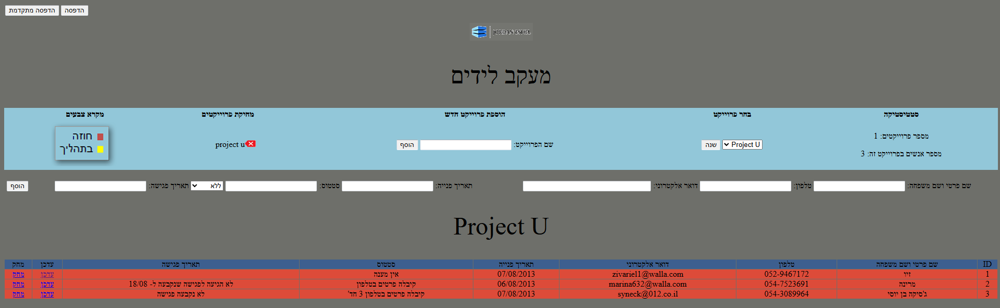

# Eshel Hayarden - Lead Tracking System

A comprehensive lead tracking and project management system for Jordan Eshel business operations.

## Features

- **Lead Management**: Track potential clients and their contact information
- **Project Organization**: Create and manage multiple projects
- **Status Tracking**: Color-coded status system (Red: Contract, Yellow: In Progress)
- **Print Functionality**: Regular and advanced printing options
- **Hebrew Support**: Full RTL (Right-to-Left) support for Hebrew text
- **Database Integration**: MySQL database for data persistence

## Website Example



*Example of the lead tracking interface showing project data, contact information, and status management*

## Project Structure

```
eshel/
├── images/           # All image assets
│   ├── logo.png     # Jordan Eshel logo
│   ├── eshel.png    # Company logo
│   └── ...
├── database/         # SQL files and database scripts
│   ├── project U.sql
│   └── ...
├── index.php        # Main application
├── index.html       # Redirect page
└── README.md        # This file
```

## Key Features

### Lead Tracking
- **Contact Information**: Name, phone, email, address
- **Status Management**: Contract, In Progress, No Status
- **Meeting Scheduling**: Track meeting dates and status
- **Project Organization**: Multiple projects with separate data

### User Interface
- **Hebrew Language Support**: Full RTL layout
- **Color-Coded Status**: Visual status indicators
- **Print Options**: Regular and advanced printing
- **Responsive Design**: Works on different screen sizes

### Database Features
- **Dynamic Table Creation**: Create new project tables
- **Data Persistence**: MySQL database storage
- **UTF-8 Support**: Proper Hebrew character encoding
- **Data Export**: Print-friendly data export

## Installation

1. **Requirements**:
   - PHP 7.0+
   - MySQL 5.7+
   - Web server (Apache/Nginx)

2. **Setup**:
   - Clone the repository
   - Configure database connection in `index.php`
   - Set up MySQL database `eshel_db`
   - Upload files to web server

3. **Database Configuration**:
   ```php
   $connection = mysqli_connect("localhost","root","","eshel_db");
   ```

## Usage

1. **Access the System**: Open `index.php` in your web browser
2. **Create Projects**: Use the "הוספת פרוייקט חדש" section
3. **Add Leads**: Fill in contact information and status
4. **Track Progress**: Use color-coded status system
5. **Print Reports**: Use print buttons for documentation

## Technology Stack

- **Backend**: PHP 7.0+
- **Database**: MySQL
- **Frontend**: HTML5, CSS3, JavaScript
- **Language**: Hebrew (RTL support)
- **Framework**: Custom PHP application

## License

This project is proprietary software for Jordan Eshel business operations.

## Contact

For questions or support, contact the development team.
